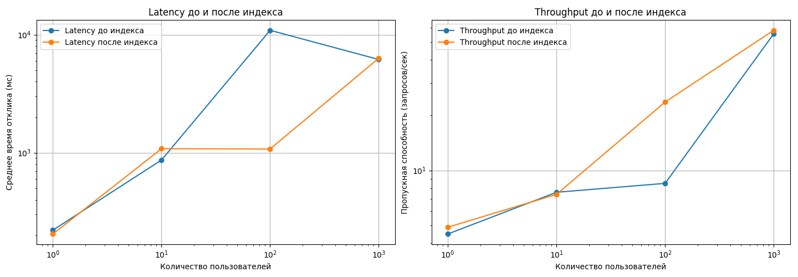

Задание
=======
1. Сгенерировать любым способ 1,000,000 анкет. Имена и Фамилии должны быть реальными, чтобы учитывать селективность индекса. Так же можно воспользовать уже готовым списком как основой.
1. Реализовать функционал поиска анкет по префиксу имени и фамилии (одновременно) в вашей социальной сети (реализовать метод /user/search из спецификации) (запрос в форме firstName LIKE ? and secondName LIKE ?). Сортировать вывод по id анкеты.
1. Провести нагрузочные тесты этого метода. Поиграть с количеством одновременных запросов. 1/10/100/1000.
1. Построить графики и сохранить их в отчет
1. Сделать подходящий индекс.
1. Повторить пункт 3 и 4.
1. В качестве результата предоставить отчет в котором должны быть:
- графики latency до индекса;
- графики throughput до индекса;
- графики latency после индекса;
- графики throughput после индекса;
- запрос добавления индекса;
- explain запросов после индекса;
- объяснение почему индекс именно такой;

Результат
=========
4. Результат инагрузочного тестирования без индекса
---------------------------------------------------
EXPLAIN до индекса
```
-
 Sort  (cost=54538.15..54538.16 rows=1 width=100) (actual time=231.068..239.508 rows=0 loops=1)
   Sort Key: id
   Sort Method: quicksort  Memory: 25kB
   ->  Gather  (cost=1000.00..54538.14 rows=1 width=100) (actual time=231.004..239.443 rows=0 loops=1)
         Workers Planned: 2
         Workers Launched: 2
         ->  Parallel Seq Scan on users  (cost=0.00..53538.04 rows=1 width=100) (actual time=225.260..225.260 rows=0 loops=3)
               Filter: (((first_name)::text ~~ 'Абрамов%'::text) AND ((last_name)::text ~~ 'Александр%'::text))
               Rows Removed by Filter: 863773
 Planning Time: 10.990 ms
 Execution Time: 241.796 ms
(11 rows)
```

После добавления индекса
```
-
 Sort  (cost=54481.85..54481.86 rows=1 width=100) (actual time=131.452..135.003 rows=0 loops=1)
   Sort Key: id
   Sort Method: quicksort  Memory: 25kB
   ->  Gather  (cost=1000.00..54481.84 rows=1 width=100) (actual time=131.447..134.997 rows=0 loops=1)
         Workers Planned: 2
         Workers Launched: 2
         ->  Parallel Seq Scan on users  (cost=0.00..53481.74 rows=1 width=100) (actual time=128.028..128.029 rows=0 loops=3)
               Filter: (((first_name)::text ~~ 'Абрамов%'::text) AND ((last_name)::text ~~ 'Александр%'::text))
               Rows Removed by Filter: 863773
 Planning Time: 3.214 ms
 Execution Time: 135.029 ms
(11 rows)
```

График
------
